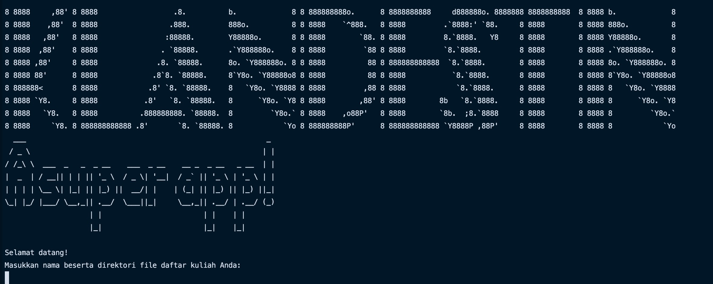
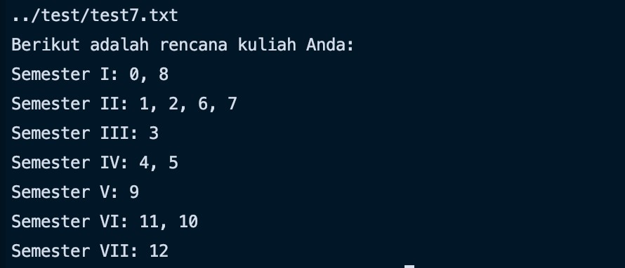

# Tugas Kecil 2 IF2211 - Strategi Algoritma
Penyusunan Rencana Kuliah dengan Topological Sort (Penerapan *Decrease and Conquer*)

## Requirements
Anda harus menginstal Java di dalam device Anda untuk menggunakan program ini. Anda bisa mengunduhnya [disini](https://www.java.com/en/download/)

## WELCOME!
Untuk menjalankan program melalui command line, silakan navigasi ke folder bin. Kemudian masukkan:
```
  java RencanaKuliah
```


Kemudian, masukkan `nama_file.txt` dan direktorinya yang berisi daftar mata kuliah beserta prasyaratnya dan program akan menampilkan rencana kuliah yang bisa dihasilkan dari persoalan tersebut

Contoh:



## Author
Andres Jerriel Sinabutar (13519218) <br>
Teknik Informatika ITB
